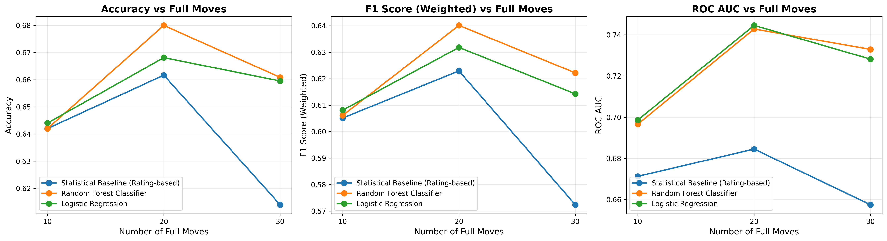
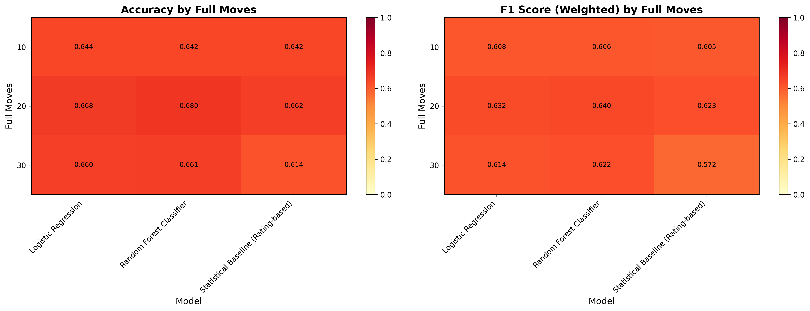
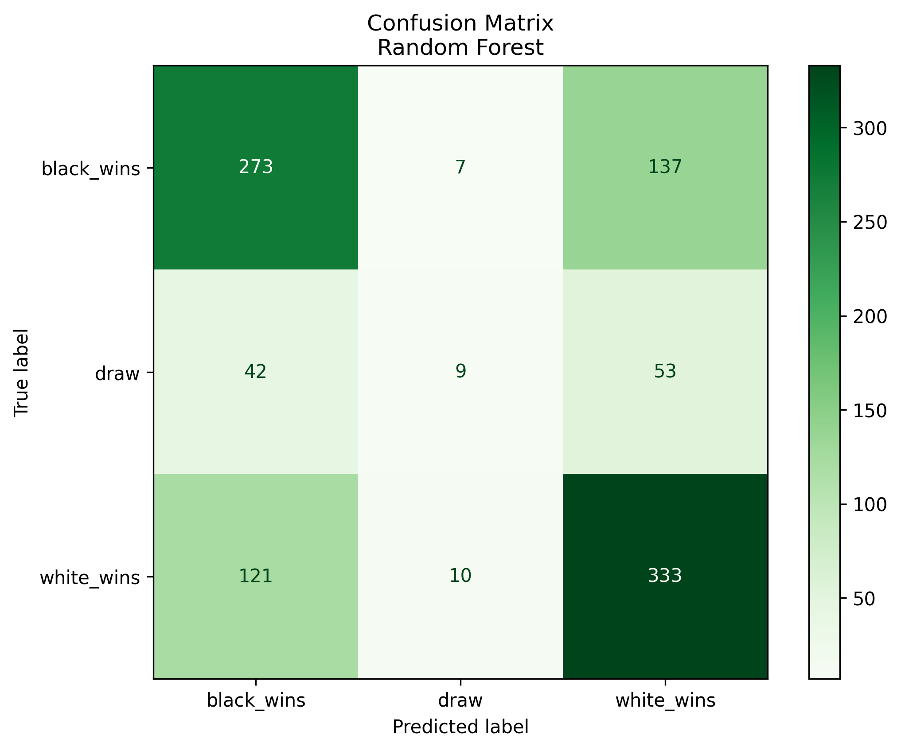
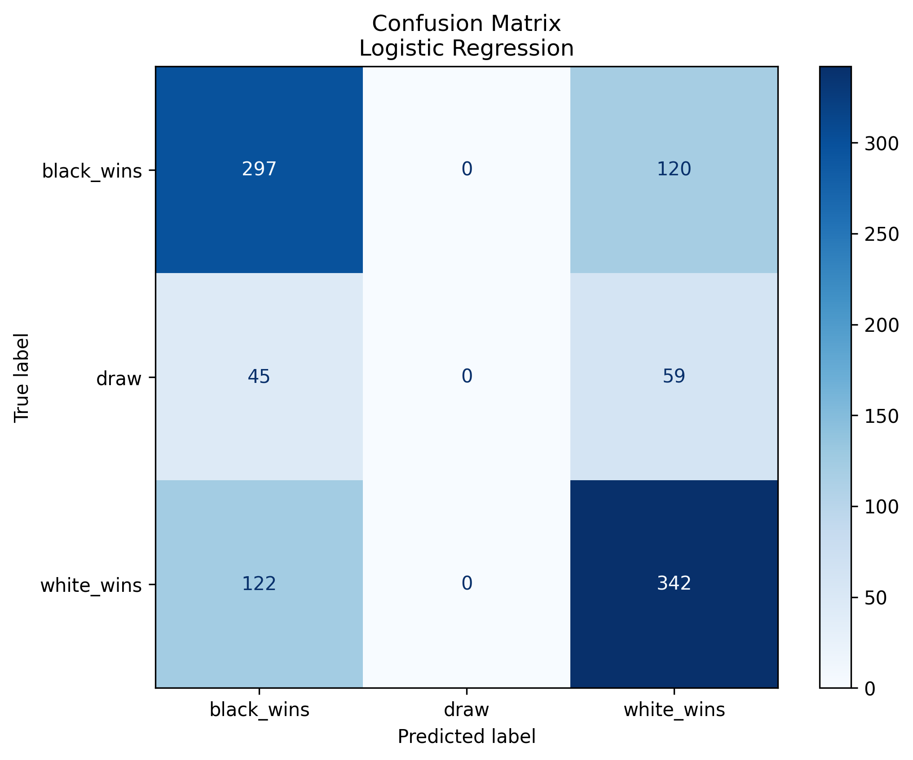
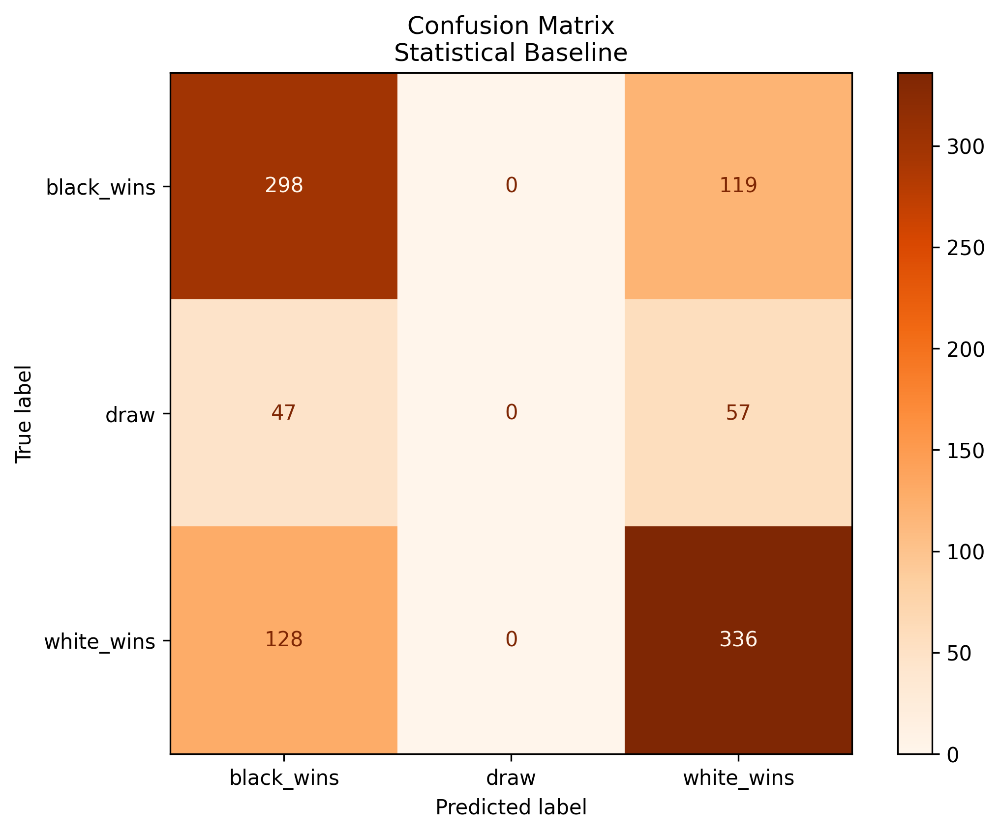

# Przewidywanie Wyniku Partii Szachowej na Podstawie Pozycji z Wybranego Momentu Gry

## Problem

Czy można przewidzieć wynik partii szachowej (wygrana białych, wygrana czarnych lub remis) na podstawie pozycji z wybranego momentu gry, bez symulowania całej partii do końca? To pytanie jest kluczowe dla zrozumienia, na ile wczesne fazy gry determinują jej ostateczny rezultat.

W praktyce mamy dostęp do milionów partii szachowych zapisanych w formacie PGN. Z każdej partii możemy wyodrębnić pozycję z konkretnego momentu (np. po 10, 20 lub 30 pełnych ruchach) i na tej podstawie próbować przewidzieć końcowy wynik.


## Dotychczasowe Rozwiązania

### Tradycyjne Podejścia

Najbardziej oczywiste rozwiązanie to symulowanie partii do końca przy użyciu silników szachowych (np. Stockfish). Jednak jest to czasochłonne i wymaga dużej mocy obliczeniowej. Silniki szachowe mogą ocenić pozycję, ale nie przewidują bezpośrednio wyniku partii. Ocena pozycji (np. +2.5 dla białych) wskazuje na przewagę, ale nie gwarantuje wygranej.

Proste heurystyki, takie jak różnica w materiale czy różnica w rankingach ELO, mogą dawać pewne wskazówki, ale są zbyt uproszczone.

### Podejścia z Uczenia Maszynowego

Publikacja "Predicting the Outcome of a Chess Game by Statistical and Machine Learning Techniques" (Héctor Apolo Rosales Pulido) pokazuje, że:

- Modele statystyczne (regresja logistyczna) mogą osiągać przyzwoite wyniki
- Modele ML (drzewa decyzyjne, random forest) przewyższają proste metody statystyczne
- Najważniejsze cechy to: różnica rankingów ELO, ocena pozycji przez silnik, przewaga materiału
- Jakość predykcji rośnie wraz z liczbą przeanalizowanych ruchów

## Nasze Podejście

### Główne Założenia

Nasza implementacja opiera się na publikacji, ale wprowadza systematyczną analizę wpływu liczby pełnych ruchów na jakość predykcji. Eksperymentujemy z różną liczbą pełnych ruchów (10, 20, 30), aby zbadać, jak ilość informacji wpływa na dokładność modeli.

Porównujemy trzy modele:
- **Model statystyczny bazowy**: Przewiduje wynik wyłącznie na podstawie różnicy rankingów ELO
- **Regresja logistyczna**: Klasyczny model statystyczny, interpretowalny i szybki
- **Random Forest**: Zaawansowany model ML, który może uchwycić złożone zależności

### Architektura Rozwiązania

```
Dane wejściowe (Lichess API)
    ↓
Preprocessing (filtrowanie: ≥20 półruchów, rankingi, zakończone partie)
    ↓
Ekstrakcja cech (pozycja po N pełnych ruchach)
    ↓
Trenowanie modeli (równoległe)
    ↓
Porównanie i wybór najlepszego modelu
    ↓
Eksperyment z różną liczbą ruchów
    ↓
Wizualizacja wyników
```

### Ekstrakcja Cech

Dla każdej partii, po N pełnych ruchach, ekstrahujemy:

**Cechy rankingowe:**
- Ranking białych i czarnych
- Różnica rankingów (kluczowy predyktor)
- Średnia rankingów

**Cechy pozycyjne:**
- Średnia ocena pozycji (material-based evaluation)
- Odchylenie standardowe ocen
- Maksymalna/minimalna ocena
- Ostateczna ocena pozycji
- Trend oceny (zmiana w czasie)

**Cechy kontekstowe:**
- Kontrola czasu (blitz/rapid/classical)
- Identyfikacja debiutu

Łącznie ekstrahujemy około 15 cech z każdej partii.

## Metodyka

### Zbiór Danych

Źródłem danych jest Lichess.org - publiczna baza danych partii szachowych. Filtrujemy partie według następujących kryteriów:

- Partie z co najmniej 20 półruchami
- Partie z ważnymi rankingami obu graczy
- Tylko zakończone partie (bez porzuconych)
- Rankingi w zakresie 1500-3000

W eksperymencie wykorzystaliśmy około 4-5 tysięcy partii dla każdej konfiguracji liczby ruchów.

### Modele

**Model Statystyczny Bazowy:**
Przewiduje wynik wyłącznie na podstawie różnicy rankingów. Jeśli różnica > 50 punktów, wygrywa silniejszy gracz; w przeciwnym razie przewidujemy remis. Służy jako punkt odniesienia (baseline).

**Regresja Logistyczna:**
Klasyczny model statystyczny wykorzystujący wszystkie ekstrahowane cechy. Jest interpretowalny - możemy zobaczyć, które cechy są najważniejsze. Szybki w trenowaniu.

**Random Forest:**
Ensemble method z wieloma drzewami decyzyjnymi. Może uchwycić nieliniowe zależności między cechami. Odporny na overfitting.

### Eksperyment

Eksperyment polega na trenowaniu wszystkich trzech modeli dla różnych wartości liczby pełnych ruchów:
- 10 pełnych ruchów (20 półruchów) - wczesna faza gry
- 20 pełnych ruchów (40 półruchów) - środek gry
- 30 pełnych ruchów (60 półruchów) - bardziej rozwinięta pozycja

Dla każdej konfiguracji mierzymy accuracy, F1 Score, ROC AUC, precision i recall.

## Wyniki

### Wpływ Liczby Ruchów na Jakość Predykcji



Wykresy pokazują, jak różne metryki zmieniają się w zależności od liczby przeanalizowanych pełnych ruchów. Widać wyraźnie, że:

- **Random Forest osiąga najlepsze wyniki** przy 20 pełnych ruchach (68% accuracy, F1 0.48, ROC AUC 0.74)
- Więcej ruchów nie zawsze oznacza lepszą predykcję - dla 30 ruchów wyniki są nieco gorsze
- Wszystkie modele ML znacząco przewyższają prosty model bazowy

### Porównanie Modeli



Tabele heatmap pokazują szczegółowe wyniki dla każdego modelu i liczby ruchów. Ciemniejsze kolory oznaczają lepsze wyniki.

### Analiza Błędów







Macierze pomyłek pokazują, gdzie modele popełniają błędy. Przekątna reprezentuje poprawne przewidywania, a komórki poza przekątną - błędy. Widać, że wszystkie modele mają problemy z przewidywaniem remisów, co jest typowe dla tego typu problemów.

### Kluczowe Wnioski

1. **Optymalna liczba ruchów to 20** - więcej ruchów nie zawsze poprawia wyniki, prawdopodobnie z powodu mniejszej liczby dostępnych partii lub większej złożoności pozycji

2. **Random Forest jest najlepszym modelem** - osiąga 68% accuracy po 20 pełnych ruchach, co jest znaczącym postępem w porównaniu do modelu bazowego (66.2%)

3. **Różnica rankingów ELO jest najważniejszym predyktorem** - nawet prosty model bazowy osiąga przyzwoite wyniki (66.2%), ale dodanie cech pozycyjnych znacząco poprawia predykcję

4. **Cechy pozycyjne mają znaczenie** - statystyki z oceny pozycji (trend, odchylenie) poprawiają jakość predykcji w porównaniu do samej różnicy rankingów

## Wkład i Zastosowania

### Wkład Naukowy

1. **Systematyczna analiza wpływu liczby ruchów** - badamy, jak ilość informacji wpływa na jakość predykcji
2. **Porównanie modeli na tych samych danych** - sprawiedliwe porównanie różnych podejść z użyciem tych samych metryk
3. **Reprodukowalna metodologia** - pełna implementacja dostępna publicznie w repozytorium Git

### Praktyczne Zastosowania

1. **Analiza partii w czasie rzeczywistym** - szybka ocena szans graczy podczas rozgrywki
2. **Trening szachowy** - identyfikacja momentów, w których partia się rozstrzyga
3. **Systemy rekomendacji** - sugerowanie najlepszych ruchów na podstawie przewidywanego wyniku

## Technologie

- **Python 3.10+** - język programowania
- **Scikit-learn** - modele uczenia maszynowego
- **Python-Chess** - analiza pozycji szachowych
- **Pandas/NumPy** - przetwarzanie danych
- **Matplotlib** - wizualizacja wyników
- **Lichess API** - pobieranie danych

## Referencje

- Rosales Pulido, H. A. "Predicting the Outcome of a Chess Game by Statistical and Machine Learning Techniques"
- Lichess API: https://lichess.org/api
- Python-Chess Library: https://python-chess.readthedocs.io/
